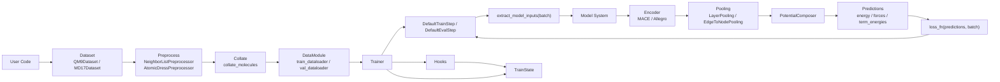

# MolNex Core Interface Stabilization Spec

Status: Draft
Author: Codex
Date: 2026-04-10

## 1. Summary

This spec proposes a focused stabilization pass for MolNex's core interfaces.

The goal is not to redesign the framework. The goal is to make the existing
layering reliable by aligning four contracts that currently drift:

1. data schema
2. model forward signature
3. loss signature
4. packaging and documentation surface

This is a docs-first, breaking refactor. It does not preserve backward
compatibility with the current ambiguous interfaces.

The intended result is that the main training path:

`dataset/preprocess -> collate -> trainer -> encoder/composer -> loss`

has one canonical contract, one canonical set of examples, and one end-to-end
smoke test suite that locks the behavior in place.

## 2. Background

MolNex already has a good high-level module split:

- `molix`: training loop, steps, hooks, data utilities
- `molrep`: reusable representation-learning blocks
- `molpot`: potential terms and composition
- `molzoo`: encoder assemblies such as MACE and Allegro

This split is directionally correct and should be preserved.

The current problem is not the layering itself. The current problem is that the
contracts across these layers are not fully converged.

Observed issues:

- `edge_index` format is inconsistent across data code and model code.
- docs describe capabilities and APIs that no longer match implementation.
- examples use stale names such as `TrainStep`, `EvalStep`, `LJ126Term`, and
  `terms=...` that are not the current public API.
- packaging metadata does not fully match the intended public module surface.
- the trainer docs imply more built-in behavior than the trainer actually owns.

## 3. Goals

- Define one canonical in-memory batch contract for the training path.
- Define one canonical default model invocation contract.
- Define one canonical default loss invocation contract.
- Keep the current modular architecture and avoid a large rewrite.
- Preserve research flexibility through custom steps and hooks.
- Make docs, tests, and packaging reflect the actual public API.
- Make the user-facing e2e API explicit before code changes land.

## 4. Non-Goals

- Replacing the `dict[str, Tensor | dict]` data model.
- Replacing `Trainer + Step + Hook` with a larger framework.
- Reworking MACE or Allegro mathematics.
- Introducing a new graph abstraction layer.
- Solving every training-system feature gap such as distributed training,
  checkpoint resume, AMP, or scheduler orchestration in this pass.

## 5. Design Principles

- Contract first: types and tensor shapes are more important than new features.
- Minimal surface area: prefer a few stable conventions over many optional paths.
- Research-friendly: keep escape hatches in custom steps, hooks, and direct
  module composition.
- Explicit ownership: `molix` owns execution, `molrep` owns representation
  blocks, `molpot` owns energy composition, `molzoo` owns assembled encoders.
- Prefer a clean break over dual-format or dual-API compatibility layers.

## 6. Proposed Decisions

### 6.1 Canonical `edge_index` format

Decision:

- Canonical runtime format will be `LongTensor[E, 2]`.
- Semantics are:
  - `edge_index[:, 0] = source`
  - `edge_index[:, 1] = destination`

Rationale:

- Most model and composition code already reads `edge_index[:, 0/1]`.
- `PotentialComposer`, MACE, Allegro, and edge-to-node pooling become simpler
  under this convention.
- It avoids repeated orientation branching in the hot path.

Migration:

- No backward compatibility layer will be maintained.
- All data-prep code must emit `[E, 2]`.
- Internal modules may assume `[E, 2]` immediately after refactor.
- Old `[2, E]` inputs should fail fast instead of being silently normalized.

### 6.2 Canonical batch contract

Decision:

- The canonical training batch remains a plain Python dictionary.
- Reserved top-level keys:
  - `Z: LongTensor[N]`
  - `pos: FloatTensor[N, 3]`
  - `edge_index: LongTensor[E, 2]` optional
  - `bond_diff: FloatTensor[E, 3]` optional
  - `bond_dist: FloatTensor[E]` optional
  - `batch: LongTensor[N]`
  - `num_graphs: int`
  - `num_atoms: LongTensor[B]`
  - `targets: dict[str, Tensor]` optional
  - `extras: dict[str, Any]` optional

Additional rules:

- `targets` are not model inputs by default.
- `extras` are explicitly non-contractual and may be ignored by core modules.
- graph-level targets should have batch length `B`.
- atom-level targets should either be flattened to `N_total` or carried with an
  explicit mask if padding is required.

### 6.3 Canonical model invocation contract

Decision:

- The default trainer path will invoke models with keyword tensors only:
  `model(**model_inputs)`.
- `targets`, `extras`, and unrelated bookkeeping keys must not be passed to the
  model implicitly.

Implementation direction:

- Introduce a small helper in `molix` to extract model inputs from a batch.
- Default steps use this helper before calling `trainer.model`.
- If a user needs a different convention, they should use a custom step.

Rationale:

- This preserves the repo's stated "dict-first" direction while avoiding
  accidental coupling between training metadata and model signatures.
- It allows encoder-only modules and composer-style modules to remain clean.

### 6.4 Canonical default loss contract

Decision:

- The framework default remains:
  `loss_fn(predictions, batch)`.

Clarification:

- This is the default contract for built-in steps.
- Molecular tasks often need both predictions and structured batch targets,
  especially when energy, forces, masks, and auxiliary metadata coexist.
- Users who prefer `loss_fn(predictions, targets)` may still implement that in
  custom steps.

Consequence:

- Docs, examples, and tests must stop mixing the two conventions as if both were
  equally canonical.

### 6.5 Trainer scope

Decision:

- `Trainer` remains intentionally minimal.
- The trainer owns:
  - loop control
  - state
  - hook dispatch
  - train/eval stage transitions
  - step delegation
- The trainer does not implicitly own in this pass:
  - batch device transfer
  - AMP
  - scheduler stepping
  - gradient accumulation policy
  - resume semantics

Rationale:

- The current implementation is already closest to this model.
- The spec should align the documented product with the actual framework shape,
  instead of forcing hidden complexity into the base loop.

Future direction:

- Device and AMP can be added later, but only as explicit opt-in behavior.

### 6.6 Public API cleanup

Decision:

- Public docs must reflect the current exported names.
- Examples must only use symbols that exist in the package.
- Documentation is the first deliverable for this refactor.

Minimum cleanup:

- Replace stale `TrainStep` and `EvalStep` examples with the actual step
  protocol or `DefaultTrainStep` and `DefaultEvalStep`.
- Replace stale `LJ126Term` and `terms=...` examples with `LJ126` and
  `potentials=...`.
- Ensure encoder and composer examples use the same `edge_index` convention as
  the canonical batch contract.
- Make README and module quickstarts normative for the canonical path.

### 6.7 Packaging completeness

Decision:

- The published wheel must include every package intended as public surface.
- Runtime dependencies must match actual imports.

Minimum cleanup:

- include `src/molzoo` in package build configuration
- audit runtime dependencies such as `molcfg`

### 6.8 User-Facing E2E API

Decision:

- The spec must define the intended user-facing training path explicitly.
- The docs should show the canonical path using the real exported modules,
  canonical batch schema, and canonical loss contract.

Target documented usage:

```python
import torch
import torch.nn as nn
import torch.nn.functional as F
from torch.utils.data import DataLoader

from molix import Trainer
from molix.data.collate import collate_molecules
from molix.data.tasks.neighbor_list import NeighborList
from molix.datasets.qm9 import QM9Source
from molpot.composition import LayerPooling, LJParameterHead, PotentialComposer
from molpot.potentials import LJ126
from molrep.embedding.node import DiscreteEmbeddingSpec
from molzoo import MACE


class LoaderDataModule:
    def __init__(self, train_loader, val_loader):
        self._train_loader = train_loader
        self._val_loader = val_loader

    def train_dataloader(self):
        return self._train_loader

    def val_dataloader(self):
        return self._val_loader


class EnergySystem(nn.Module):
    def __init__(self):
        super().__init__()
        self.encoder = MACE(
            node_attr_specs=[
                DiscreteEmbeddingSpec(input_key="Z", num_classes=119, emb_dim=64),
            ],
            num_elements=119,
            num_features=64,
            r_max=5.0,
            num_interactions=2,
        )
        self.pool = LayerPooling("mean")
        self.composer = PotentialComposer(
            head=LJParameterHead(feature_dim=64, hidden_dim=64),
            potentials={"lj126": LJ126()},
        )

    def forward(
        self,
        Z,
        pos,
        edge_index,
        bond_diff,
        bond_dist,
        batch,
        num_graphs,
        num_atoms,
        **_,
    ):
        encoded = self.encoder(
            Z=Z,
            bond_dist=bond_dist,
            bond_diff=bond_diff,
            edge_index=edge_index,
        )
        node_features = self.pool(encoded)
        return self.composer(
            node_features=node_features,
            data={
                "pos": pos,
                "edge_index": edge_index,
                "bond_dist": bond_dist,
                "batch": batch,
                "num_graphs": num_graphs,
                "num_atoms": num_atoms,
            },
            compute_forces=False,
        )


def energy_loss(predictions, batch):
    target = batch["targets"]["U0"]
    pred = predictions["energy"]
    return F.mse_loss(pred, target)


dataset = QM9Source(
    root="./data/qm9",
    preprocessors=[NeighborList(cutoff=5.0)],
    total=1024,
)
dataset.prepare()
train_set, val_set = dataset.split(train_ratio=0.9, random_seed=42)

train_loader = DataLoader(
    train_set,
    batch_size=32,
    shuffle=True,
    collate_fn=collate_molecules,
)
val_loader = DataLoader(
    val_set,
    batch_size=32,
    shuffle=False,
    collate_fn=collate_molecules,
)

trainer = Trainer(
    model=EnergySystem(),
    loss_fn=energy_loss,
    optimizer_factory=lambda params: torch.optim.Adam(params, lr=1e-3),
)

state = trainer.train(
    LoaderDataModule(train_loader, val_loader),
    max_epochs=10,
)
print(state["eval/loss"])
```

This example is normative for:

- canonical batch keys
- canonical `edge_index` shape
- canonical `model(**model_inputs)` invocation
- canonical `loss_fn(predictions, batch)` contract
- canonical encoder plus composer integration pattern

## 7. Architecture Diagram



## 8. Architecture After Stabilization

The architecture remains:

- `molix.data` produces canonical sample and batch dictionaries
- `molix.core.steps` converts canonical batch to model inputs and calls loss
- `molzoo` encoders consume keyword tensors only
- `molpot` composition consumes explicit node features plus canonical graph data
- `molix.core.hooks` observes state and outputs, but does not define model
  semantics

This is a stabilization spec, not a re-architecture spec.

## 9. Required Code Changes

### 9.1 Data layer

- normalize `edge_index` to `[E, 2]` in collate and preprocess paths
- update `MoleculeSample` and `MoleculeBatch` docs accordingly
- make dataset examples emit canonical batch schema

### 9.2 Trainer and steps

- add a single helper that extracts model inputs from batch dictionaries
- update default train and eval steps to use that helper
- ensure default steps never pass `targets` into `model(**batch)`
- keep `loss_fn(predictions, batch)` as the built-in default

### 9.3 Models and composition

- remove format ambiguity checks where the contract can now be assumed
- keep temporary normalization only at external boundaries if required
- align comments and docstrings with `[E, 2]`

### 9.4 Docs

- update docs before or together with implementation, not after
- sync README and module docs to actual APIs
- document trainer minimalism explicitly
- add the canonical e2e example shown in this spec
- add the architecture diagram to top-level docs or architecture docs

### 9.5 Tests

- add a canonical end-to-end smoke test:
  - sample dict
  - collate
  - encoder
  - composer
  - loss
  - trainer
- add contract tests for:
  - `edge_index` fail-fast behavior for non-canonical shapes
  - default step model-input extraction
  - loss contract
  - packaging/import surface

## 10. Breaking Change Policy

- This refactor is intentionally not backward compatible.
- No dual-format support should remain in the final code.
- Old docs, examples, and tests should be updated in the same change window.
- Invalid old-style inputs should fail explicitly rather than being adapted.

Required breakpoints:

- `edge_index` canonicalized to `[E, 2]` only
- stale public names removed from docs
- default model invocation narrowed to model inputs only

## 11. Acceptance Criteria

This spec is complete when all of the following are true:

1. One documented `edge_index` format is used across data, models, composition,
   and examples.
2. Default steps call models with model inputs only, not raw batch dictionaries
   containing targets and extras.
3. Default docs use one loss contract consistently:
   `loss_fn(predictions, batch)`.
4. Public examples import only real exported symbols.
5. `molzoo` is included in packaging if it is part of the public framework.
6. A smoke test covers the full canonical path from batch construction to loss.
7. Documentation about trainer responsibilities matches actual implementation.
8. The docs contain a single user-facing e2e example and architecture diagram
   consistent with the implementation.
9. The final code does not contain compatibility branches for legacy
   `edge_index` formats in the canonical path.

## 12. Risks

- Choosing `[E, 2]` as a hard break will require immediate changes in older
  data code and tests.
- Tightening model-input extraction will break code that relied on accidental
  forwarding of non-model keys.
- Keeping the trainer minimal may disappoint users expecting a Lightning-like
  experience, but this is a product-positioning clarification rather than a
  technical regression.

## 13. Alternatives Considered

### Alternative A: Keep accepting both `edge_index` formats everywhere

Rejected.

Reason:

- It preserves ambiguity in every layer.
- It spreads normalization logic into hot-path model code.
- It makes docs and tests permanently branch on representation details.

### Alternative B: Make `loss_fn(predictions, targets)` the new default

Rejected for now.

Reason:

- It is less expressive for structured molecular supervision.
- It would force a larger redesign of current default losses and examples.
- The current codebase is already closer to `loss_fn(predictions, batch)`.

### Alternative C: Expand `Trainer` to own device, AMP, accumulation, scheduler

Deferred.

Reason:

- It increases scope significantly.
- It is not required to stabilize the current architecture.
- It should be treated as a separate product decision.

## 14. Open Questions for Review

1. Should model-input extraction be explicit through a helper such as
   `extract_model_inputs(batch)`, or do you want a stricter typed wrapper?
2. Do you want the trainer to stay minimal by design, or should a follow-up spec
   add explicit `device` and AMP support?
3. Is `molexp` structural compatibility still an active requirement, or can that
   protocol layer be demoted to documentation-only status?

## 15. Recommended Execution Order

Phase 1:

- freeze contract decisions in this spec
- update README, quickstarts, schema docs, and architecture docs first
- publish the canonical e2e example and architecture diagram

Phase 2:

- normalize `edge_index` to `[E, 2]` everywhere
- add model-input extraction helper
- update default steps
- remove old compatibility branches and stale symbol references

Phase 3:

- fix packaging metadata
- add end-to-end smoke tests
- audit protocol and abstraction leftovers
